# Kubernetes Pods Explained (2025 Update)

## What is a Pod?

A Pod is the smallest and simplest Kubernetes object - the basic execution unit in Kubernetes. In 2025, with the evolution of Kubernetes, Pods remain fundamental but now have enhanced features for better security and resource management.

**Key Characteristics (2025 Updates):**
- Smallest deployable unit in Kubernetes
- Contains one or more containers (with improved container coordination)
- Shared storage/network resources
- Enhanced security contexts with default AppArmor profiles
- Built-in health checks with AI-assisted failure prediction (new in 2025)

## Pod Structure (Mermaid Diagram)

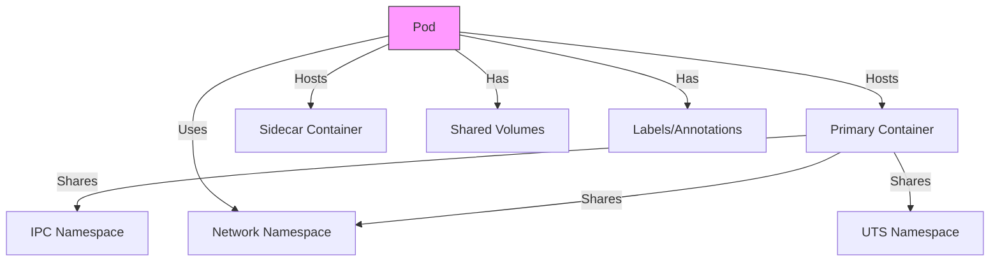

## Example Pod Manifest (2025 Syntax)

```yaml
apiVersion: v1
kind: Pod
metadata:
  name: ai-web-app
  labels:
    app: web
    ai-tier: frontend
  annotations:
    autopilot.kubernetes.io/health-prediction: "enabled" # 2025 feature
spec:
  securityContext:
    appArmorProfile: runtime/default # Enhanced in 2025
  containers:
  - name: web-container
    image: web-server:2025.04
    ports:
    - containerPort: 8080
    resources:
      limits:
        cpu: "2"
        memory: "4Gi"
      requests:
        cpu: "1"
        memory: "2Gi"
    livenessProbe:
      httpGet:
        path: /health
        port: 8080
      initialDelaySeconds: 5
      periodSeconds: 10
      successThreshold: 1
      failureThreshold: 3
  - name: ai-sidecar
    image: ai-assistant:2025.01
    command: ["/opt/ai/monitor"]
    resources:
      limits:
        nvidia.com/gpu: 1 # GPU support standardized in 2025
  volumes:
  - name: shared-data
    emptyDir: {}
```

## Key Concepts

### 1. Multi-Container Pods
Pods can run multiple containers that:
- Share the same network namespace (localhost communication)
- Can share volumes
- Have synchronized lifecycles

**Example Use Case:**
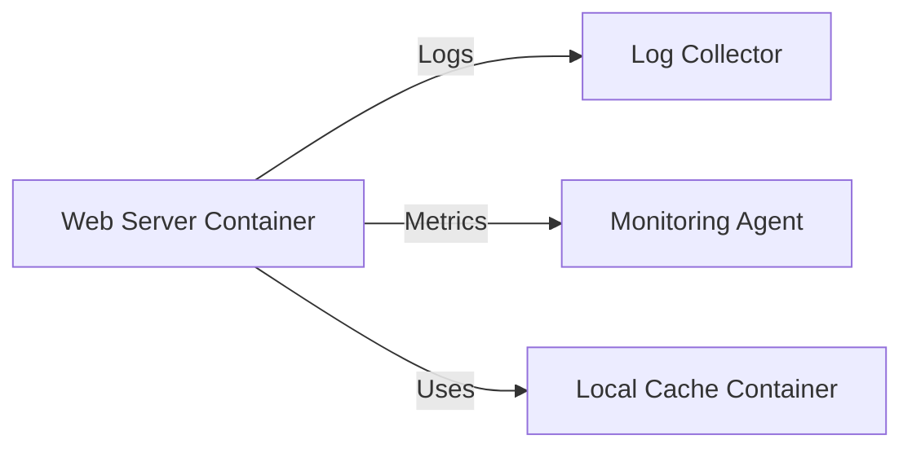

### 2. Pod Networking
Each Pod gets:
- Unique IP address (IPv6 by default in 2025 clusters)
- Shared network namespace for all containers
- DNS name resolution (pod-ip-address.namespace.pod.cluster.local)

### 3. Pod Lifecycle
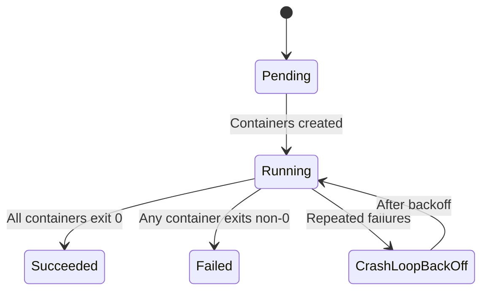

### 4. 2025 Enhancements
- **AI-Assisted Health Prediction**: Kubernetes can now predict failures before they occur
- **Default Security Profiles**: AppArmor and seccomp profiles applied by default
- **Resource Class Awareness**: Better handling of heterogeneous resources (GPUs, TPUs, FPGAs)
- **Instant Pod Recovery**: Faster restart mechanisms for stateless pods

## Common Pod Patterns

1. **Sidecar Pattern**
```yaml
containers:
- name: main
  image: my-app
- name: sidecar
  image: log-collector
```

2. **Ambassador Pattern**
```yaml
containers:
- name: app
  image: my-app
- name: ambassador
  image: proxy
```

3. **Adapter Pattern**
```yaml
containers:
- name: app
  image: my-app
- name: adapter
  image: metrics-adapter
```

## Best Practices in 2025

1. Use Pods directly only for development/testing
2. For production, use higher-level controllers (Deployments, StatefulSets)
3. Leverage the new AI health prediction annotations
4. Always define resource limits (especially for AI workloads)
5. Use Pod Disruption Budgets for critical workloads
6. Consider using Pod templates with cluster-scoped defaults

Pods remain the fundamental building block of Kubernetes in 2025, though most users interact with them through higher-level abstractions. The 2025 enhancements make them more secure and manageable while maintaining their core simplicity.


# Kubernetes Deployments Explained (2025 Update)

## What is a Deployment?

A Deployment is a higher-level abstraction that manages Pods and ReplicaSets, providing declarative updates to applications. In 2025, Deployments have evolved with new features for progressive delivery, AI-assisted scaling, and enhanced rollback capabilities.

**Key 2025 Enhancements:**
- AI-powered auto-scaling with predictive scaling
- Built-in progressive delivery hooks
- Enhanced rollback with history snapshots
- Native blue-green deployment support
- Automatic performance tuning

## Deployment Architecture (Mermaid Diagram)

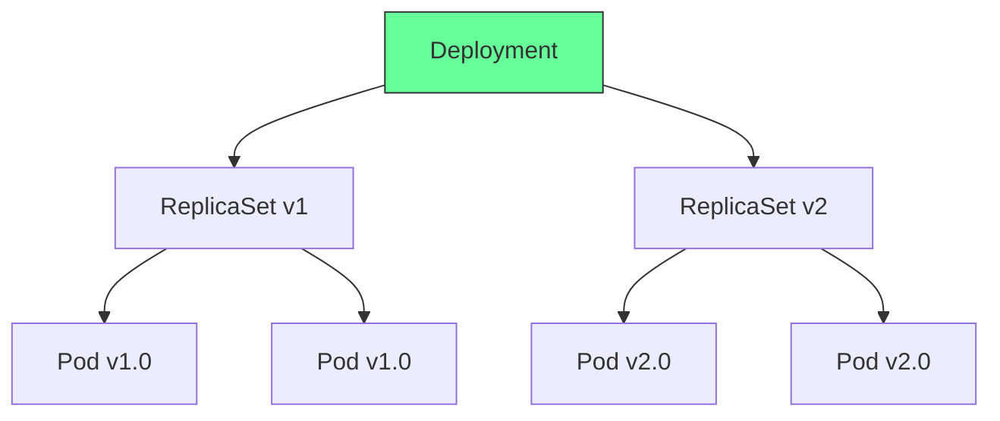

## Example Deployment Manifest (2025 Syntax)

```yaml
apiVersion: apps/v1
kind: Deployment
metadata:
  name: ai-frontend
  annotations:
    deploy.kubernetes.io/2025-rollout-strategy: "smart-progressive"
    autoscale.ai/configuration: "learning-mode"
spec:
  replicas: 3
  strategy:
    type: RollingUpdate
    rollingUpdate:
      maxSurge: 25%
      maxUnavailable: 15%
      aiHealthCheck: true  # New in 2025
  selector:
    matchLabels:
      app: ai-frontend
  template:
    metadata:
      labels:
        app: ai-frontend
        version: "2025.04"
    spec:
      containers:
      - name: web
        image: ai-frontend:2025.04
        ports:
        - containerPort: 8080
        resources:
          limits:
            cpu: "2"
            memory: "4Gi"
            nvidia.com/gpu: 1
          requests:
            cpu: "1"
            memory: "2Gi"
        livenessProbe:
          aiAssisted: true  # Uses ML for health detection
          httpGet:
            path: /health
            port: 8080
      topologySpreadConstraints:
      - maxSkew: 1
        topologyKey: topology.kubernetes.io/zone
        whenUnsatisfiable: ScheduleAnyway
```

## Key Concepts

### 1. Deployment Strategies (2025 Updates)

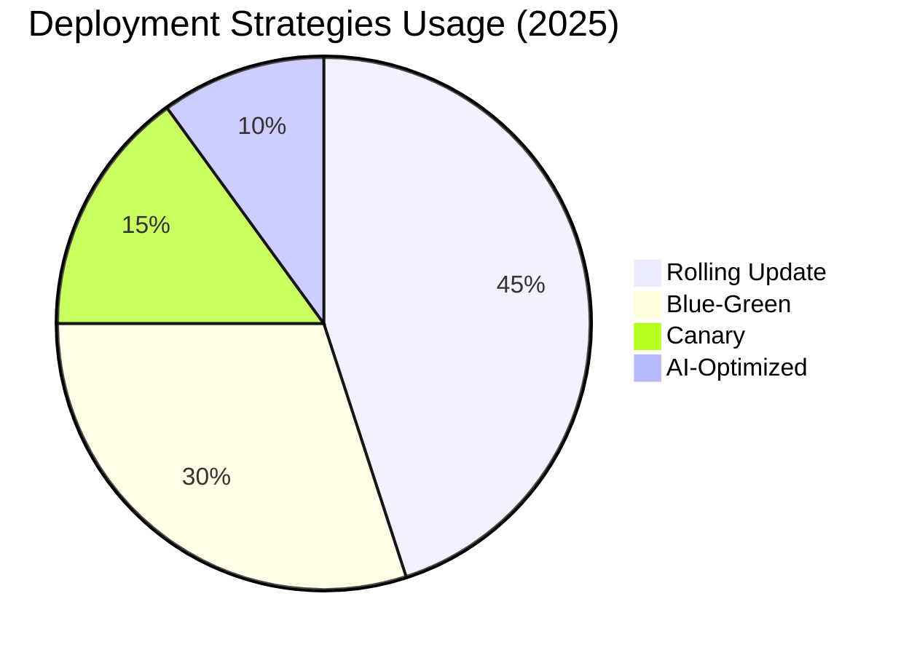

**New Strategy Types:**
- `SmartProgressive`: AI-controlled rollout speed
- `AIOptimized`: Machine learning determines best strategy
- `LoadBalancedRollout`: Traffic-aware deployment

### 2. Revision Control

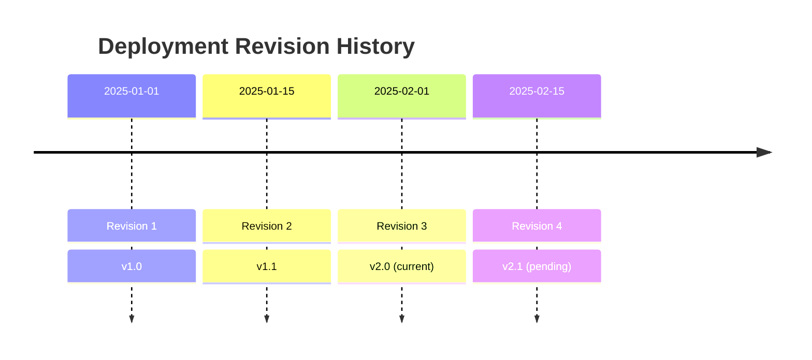

### 3. Scaling Enhancements

**2025 AI Scaling Example:**
```yaml
spec:
  replicas: 5
  aiScaling:
    enabled: true
    metrics:
    - type: PredictiveCPU
      targetAverageUtilization: 70
      historyWindow: 24h
    - type: RequestRate
      requestsPerSecond: 1000
```

## Deployment Lifecycle

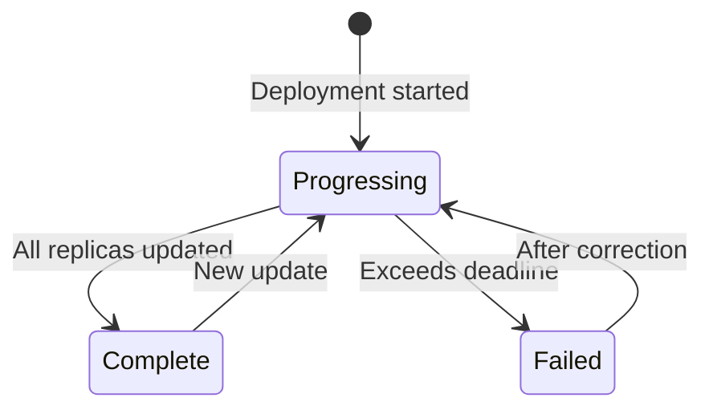

## Common Patterns (2025)

1. **AI-Assisted Canary Deployment**
```yaml
strategy:
  type: Canary
  steps:
  - setWeight: 10
    aiAnalysis: 
      duration: 15m
      metrics: [latency, error_rate]
  - pause: {}
```

2. **Multi-Region Deployment**
```yaml
topologySpreadConstraints:
- maxSkew: 1
  topologyKey: topology.kubernetes.io/region
  whenUnsatisfiable: DoNotSchedule
```

3. **Resource-Aware Deployment**
```yaml
resourceManagement:
  dynamicAllocation: true
  priorityClass: ai-critical
```

## Best Practices in 2025

1. Always use Deployment (not direct Pod creation)
2. Leverage AI scaling for variable workloads
3. Use topology constraints for high availability
4. Implement progressive delivery hooks
5. Set revision history limits (new default: 15)
6. Use the new `kubectl rollout analyze` command
7. Consider deployment templates for organization standards

Deployments in 2025 have become smarter and more autonomous while maintaining backward compatibility. The integration of AI capabilities has made them more adaptive to real-world conditions while simplifying operations.


# Kubernetes Services Explained (2025 Update)

## What is a Service?

A Service is an abstraction that defines a logical set of Pods and a policy to access them. In 2025, Services have evolved with enhanced traffic management, built-in service mesh capabilities, and smarter load balancing features.

**Key 2025 Enhancements:**
- AI-powered traffic shaping
- Native circuit breaking (no longer requires service mesh)
- Automatic DNS weight adjustments
- Integrated canary traffic routing
- Enhanced protocol support (HTTP/3, gRPC-web)

## Service Architecture (Mermaid Diagram)

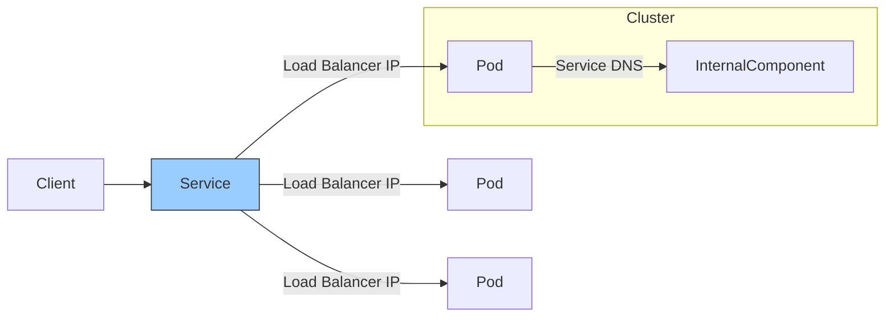

## Example Service Manifest (2025 Syntax)

```yaml
apiVersion: v1
kind: Service
metadata:
  name: ai-model-service
  annotations:
    service.kubernetes.io/traffic-shaping: "adaptive"
    service.kubernetes.io/circuit-breaker: "enabled"
spec:
  selector:
    app: ai-model
    version: "2025.04"
  ports:
  - name: http
    protocol: TCP
    port: 80
    targetPort: 8080
    appProtocol: http/3
  - name: grpc
    protocol: TCP
    port: 9000
    targetPort: 9000
    appProtocol: grpc-web
  type: ClusterIP
  sessionAffinity: ClientIP
  trafficDistribution:
    mode: intelligent
    parameters:
      latencyOptimization: true
  healthCheck:
    aiAssisted: true
    intervalSeconds: 10
```

## Service Types Comparison (2025)

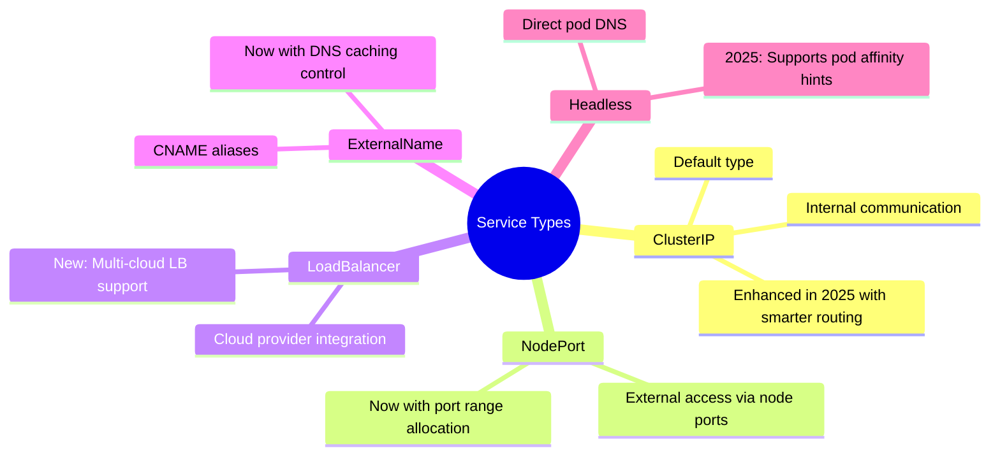

## Key Concepts

### 1. Service Discovery (2025 Updates)

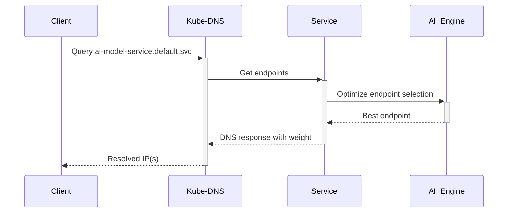

**New Discovery Features:**
- Weighted DNS responses
- Geo-aware endpoint selection
- Automatic failover zones

### 2. Traffic Management

**Example Traffic Splitting:**
```yaml
spec:
  traffic:
  - revisionName: ai-model-v1
    percent: 90
  - revisionName: ai-model-v2
    percent: 10
    configuration:
      canaryAnalysis:
        metrics:
        - name: error_rate
          threshold: 1%
        interval: 5m
```

### 3. Enhanced Protocol Support

**2025 Protocol Matrix:**
| Protocol | Features | Use Case |
|----------|----------|----------|
| HTTP/3   | QUIC, 0-RTT | Web apps |
| gRPC-web | Browser support | WASM apps |
| RSocket  | Reactive streams | Real-time |

## Service Patterns (2025)

1. **AI-Load Balanced Service**
```yaml
spec:
  trafficPolicy:
    loadBalancer:
      aiParameters:
        learningRate: 0.1
        observationWindow: 1h
```

2. **Multi-Cluster Service**
```yaml
metadata:
  annotations:
    multicluster.kubernetes.io/clusters: "us-west1,europe-west1"
spec:
  type: GlobalLoadBalancer
```

3. **Protocol-Adaptive Service**
```yaml
ports:
- name: auto
  protocol: AUTO
  port: 443
  negotiation:
    protocols: [http/2, http/3, grpc]
```

## Best Practices in 2025

1. Use ClusterIP for internal communication
2. Leverage new protocol negotiation features
3. Implement circuit breakers for resilience
4. Use AI traffic shaping for critical services
5. Annotate services for multicluster support
6. Consider service mesh only for advanced cases
7. Use the new `kubectl service analyze` command
8. Implement zero-trust security policies

Services in 2025 have become smarter traffic managers with built-in capabilities that previously required external components. The integration of AI and enhanced protocol support makes them more adaptable to modern application requirements while maintaining simplicity.


# Kubernetes Ingress Explained (2025 Update)

## What is an Ingress?

An Ingress is an API object that manages external access to cluster services, typically HTTP/HTTPS. In 2025, Ingress has evolved into a full-featured edge gateway with built-in security, advanced routing, and cloud-native CDN integration.

**Key 2025 Enhancements:**
- Native Web Application Firewall (WAF) integration
- Automatic TLS certificate management with ACME v3
- AI-driven traffic optimization
- Built-in DDoS protection
- Edge computing support with WASM plugins

## Ingress Architecture (Mermaid Diagram)

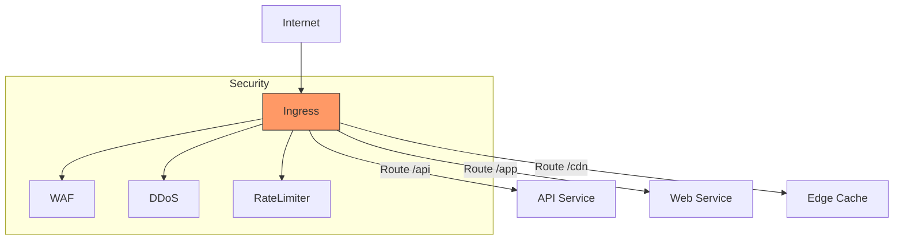

## Example Ingress Manifest (2025 Syntax)

```yaml
apiVersion: networking.k8s.io/v1
kind: Ingress
metadata:
  name: global-ingress
  annotations:
    ingress.kubernetes.io/waf-mode: "paranoid"
    ingress.kubernetes.io/cdn-integration: "auto"
    ingress.kubernetes.io/ai-optimization: "enabled"
spec:
  tls:
  - hosts:
    - example.com
    - api.example.com
    secretName: auto-tls-cert  # Automatically managed in 2025
  rules:
  - host: example.com
    http:
      paths:
      - path: /
        pathType: Prefix
        backend:
          service:
            name: web-service
            port:
              number: 80
        plugins:
          - name: wasm-image-optimizer
            config:
              quality: 80
              format: webp
  - host: api.example.com
    http:
      paths:
      - path: /v1
        pathType: Prefix
        backend:
          service:
            name: api-service
            port:
              number: 8080
        rateLimit:
          requests: 1000
          per: minute
          burst: 200
      - path: /graphql
        pathType: Exact
        backend:
          service:
            name: graphql-service
            port:
              number: 9000
  edgeComputing:
    enabled: true
    wasmModules:
    - name: auth-validator
      image: wasm/auth:v2
```

## Ingress Controller Types (2025)

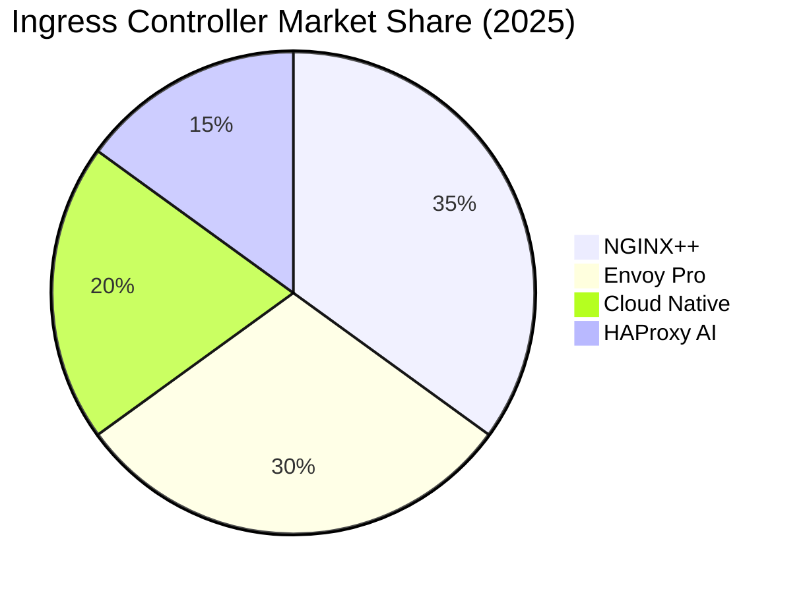

**2025 Controller Features:**
- Unified control plane for ingress/gateway
- Automatic performance tuning
- Real-time threat detection
- WASM runtime integration

## Key Concepts

### 1. Advanced Routing (2025)

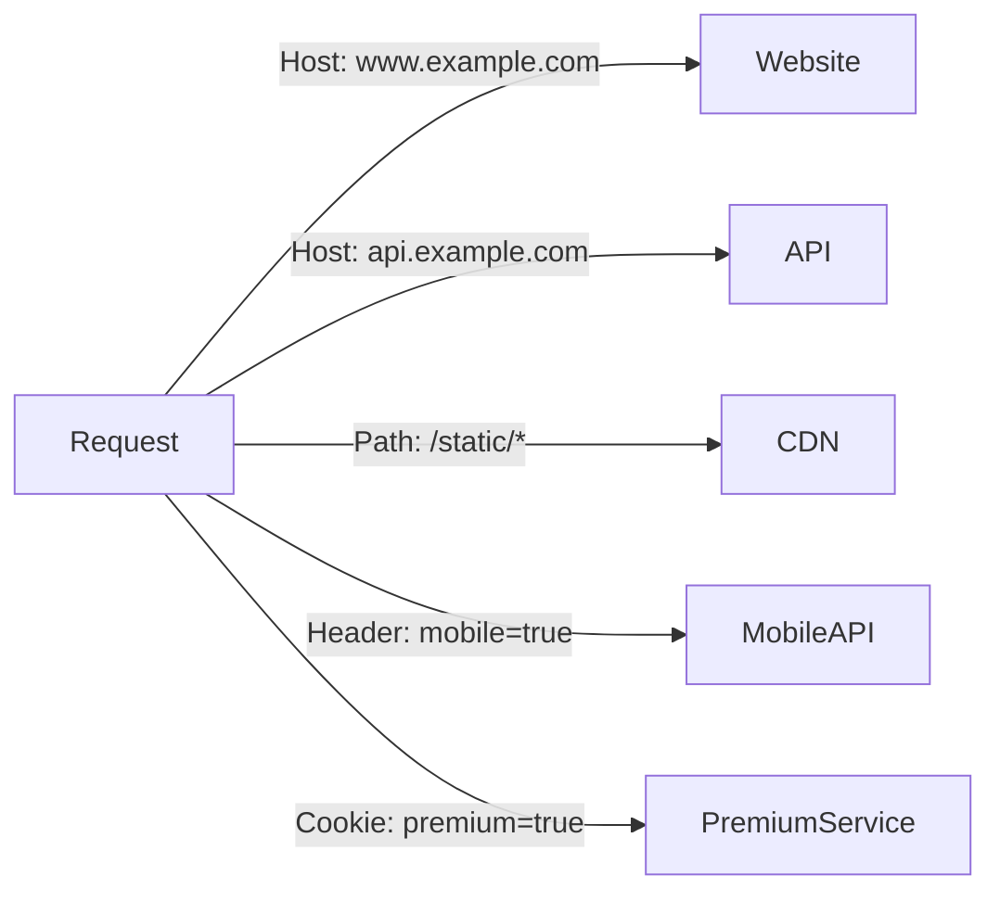

**New Routing Capabilities:**
- JWT claim-based routing
- Geolocation routing
- Device type detection
- AI-based traffic classification

### 2. Security Stack

**Built-in Security Layers:**
1. TLS 1.3 (Auto-renewal)
2. Web Application Firewall
3. DDoS Protection
4. Rate Limiting
5. Bot Detection
6. API Schema Validation

### 3. Edge Computing

```yaml
edgeComputing:
  enabled: true
  modules:
  - name: image-processor
    wasm: true
    config:
      resize: "1024x768"
  - name: auth-filter
    wasm: true
    config:
      jwtValidation: strict
```

## Ingress Patterns (2025)

1. **Global Load Balanced Ingress**
```yaml
metadata:
  annotations:
    ingress.kubernetes.io/global-load-balancing: "true"
spec:
  distribution:
    regions:
    - na
    - eu
    - asia
```

2. **AI-Optimized Traffic Ingress**
```yaml
spec:
  optimization:
    enabled: true
    parameters:
      latencyPriority: 0.8
      costPriority: 0.2
```

3. **Multi-Protocol Ingress**
```yaml
rules:
- protocol: HTTP
  paths: [...]
- protocol: gRPC
  paths: [...]
- protocol: WebSocket
  paths: [...]
```

## Best Practices in 2025

1. Use class-specific ingress controllers
2. Enable auto-TLS for all endpoints
3. Implement WAF rules early
4. Use WASM for edge processing
5. Configure global load balancing for HA
6. Monitor with new AI-driven metrics
7. Use the `kubectl ingress analyze` command
8. Implement zero-trust security policies
9. Leverage CDN integration for static assets
10. Consider ingress-as-code approaches

Ingress in 2025 has evolved from a simple routing mechanism to a full-featured edge security and optimization platform. With built-in security, automatic optimizations, and edge computing capabilities, modern Ingress controllers provide what previously required multiple external components.


# Kubernetes StatefulSets Explained (2025 Update)

## What is a StatefulSet?

A StatefulSet is a workload API object that manages stateful applications, providing guarantees about ordering, uniqueness, and persistent storage. In 2025, StatefulSets have evolved with enhanced data management, smarter scaling operations, and built-in backup integration.

**Key 2025 Enhancements:**
- AI-assisted scaling decisions
- Automatic volume snapshot integration
- Cross-zone stateful pod distribution
- Built-in data consistency checks
- Improved ordinal index handling

## StatefulSet Architecture (Mermaid Diagram)

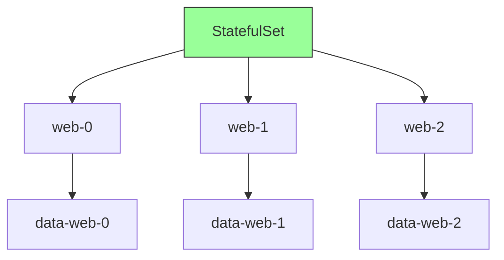

## Example StatefulSet Manifest (2025 Syntax)

```yaml
apiVersion: apps/v1
kind: StatefulSet
metadata:
  name: ai-database
  annotations:
    statefulset.kubernetes.io/auto-snapshot: "enabled"
    statefulset.kubernetes.io/scale-ai: "predictive"
spec:
  serviceName: "db-service"
  replicas: 3
  podManagementPolicy: Parallel  # Enhanced in 2025
  updateStrategy:
    type: RollingUpdate
    rollingUpdate:
      partition: 0
      aiHealthCheck: true  # New in 2025
  selector:
    matchLabels:
      app: ai-database
  template:
    metadata:
      labels:
        app: ai-database
    spec:
      containers:
      - name: database
        image: postgres-ai:2025.04
        ports:
        - containerPort: 5432
        volumeMounts:
        - name: data
          mountPath: /var/lib/postgresql/data
        resources:
          requests:
            cpu: "2"
            memory: "8Gi"
  volumeClaimTemplates:
  - metadata:
      name: data
      annotations:
        snapshot.kubernetes.io/auto: "hourly"
    spec:
      accessModes: [ "ReadWriteOnce" ]
      storageClassName: "ssd-premium"
      resources:
        requests:
          storage: 100Gi
  dataConsistency:
    enabled: true
    checkInterval: 1h
```

## StatefulSet vs Deployment (2025 Comparison)

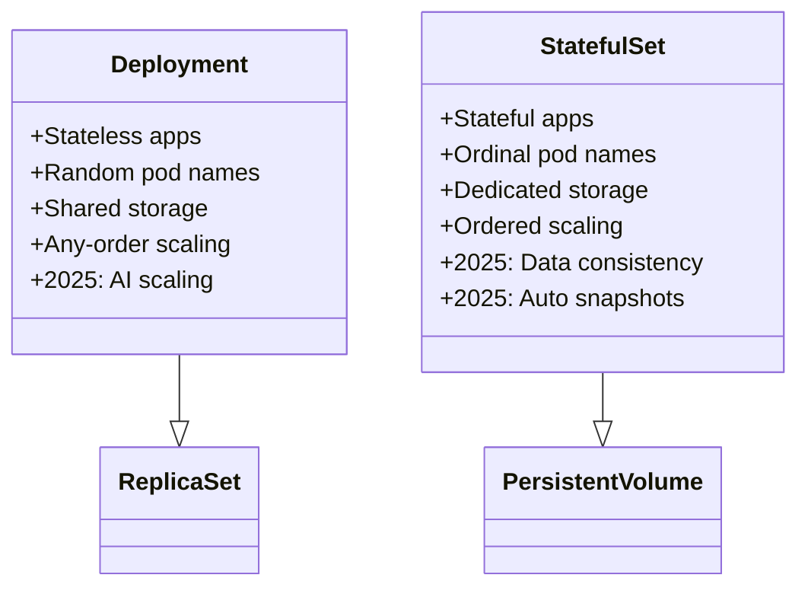

## Key Concepts

### 1. Stable Network Identity

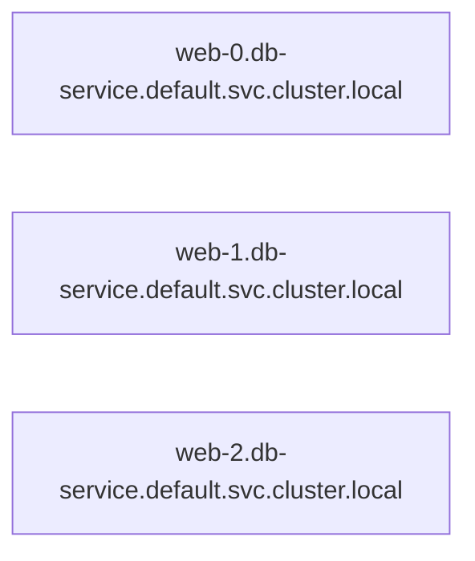

**2025 DNS Enhancements:**
- Smart DNS caching
- Geo-aware DNS responses
- Health-check aware resolution

### 2. Ordered Operations

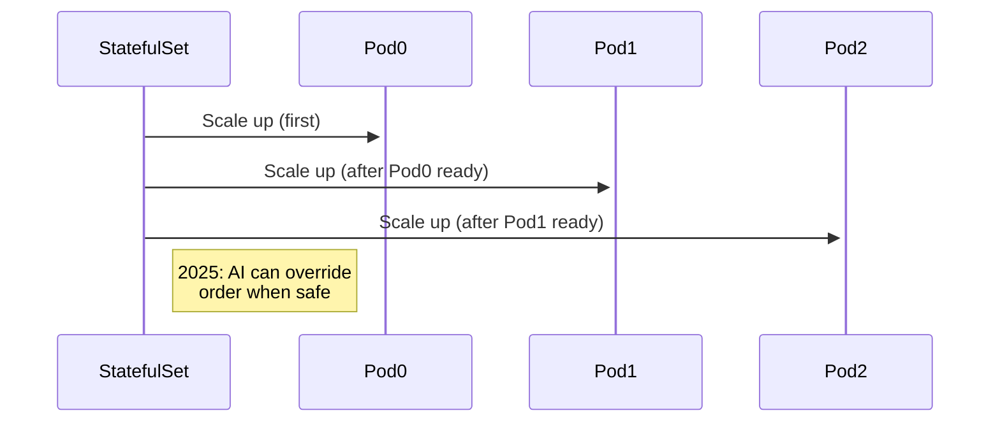

### 3. Persistent Storage

**Volume Claim Template 2025 Features:**
```yaml
volumeClaimTemplates:
- metadata:
    name: data
    annotations:
      snapshot.kubernetes.io/retention: "7d"
      snapshot.kubernetes.io/auto: "daily"
  spec:
    storageClassName: "topology-aware-ssd"
    resources:
      requests:
        storage: "1Ti"
```

## StatefulSet Patterns (2025)

1. **AI-Assisted Scaling**
```yaml
spec:
  scaling:
    aiEnabled: true
    parameters:
      minReplicas: 3
      maxReplicas: 10
      metrics:
        - type: QueryComplexity
          threshold: 500
```

2. **Multi-Zone Stateful Application**
```yaml
topologySpreadConstraints:
- maxSkew: 1
  topologyKey: topology.kubernetes.io/zone
  whenUnsatisfiable: DoNotSchedule
```

3. **StatefulSet with Backup**
```yaml
backup:
  enabled: true
  schedule: "0 2 * * *"
  destination:
    s3:
      bucket: my-backup-bucket
      region: auto
```

## Best Practices in 2025

1. Use for truly stateful applications only
2. Leverage auto-snapshotting annotations
3. Implement cross-zone topology constraints
4. Enable data consistency checks
5. Use the new `kubectl statefulset analyze` command
6. Consider AI scaling for variable workloads
7. Implement proper backup strategies
8. Use storage classes with CSI snapshot support
9. Monitor ordinal distribution
10. Test failover scenarios regularly

StatefulSets in 2025 have become more intelligent and robust, with built-in data protection features and smarter scaling capabilities. The integration of AI and automatic snapshot management reduces operational overhead while maintaining strong consistency guarantees for stateful workloads.


# Kubernetes ConfigMaps Explained (2025 Update)

## What is a ConfigMap?

A ConfigMap is an API object that stores non-confidential configuration data as key-value pairs. In 2025, ConfigMaps have evolved with enhanced features for dynamic configuration, versioning, and integration with external systems.

**Key 2025 Enhancements:**
- Built-in version history and rollback
- Dynamic configuration updates without pod restarts
- AI-assisted configuration validation
- External system synchronization
- Enhanced merge strategies

## ConfigMap Architecture (Mermaid Diagram)

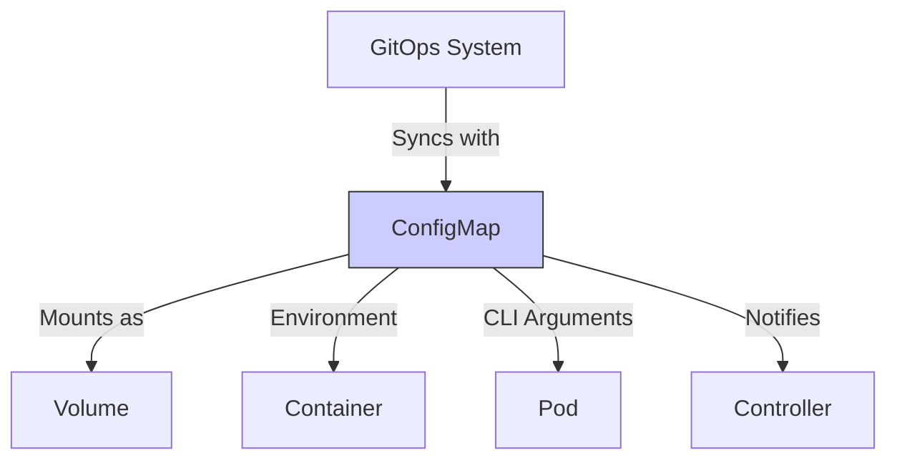

## Example ConfigMap Manifest (2025 Syntax)

```yaml
apiVersion: v1
kind: ConfigMap
metadata:
  name: ai-service-config
  annotations:
    config.kubernetes.io/version: "1.3"
    config.kubernetes.io/auto-reload: "enabled"
    config.kubernetes.io/validation-schema: |
      {
        "$schema": "http://json-schema.org/draft-07/schema#",
        "type": "object",
        "properties": {
          "MODEL_VERSION": {
            "type": "string",
            "pattern": "^\\d+\\.\\d+\\.\\d+$"
          }
        }
      }
data:
  MODEL_VERSION: "2025.04.1"
  FEATURE_FLAGS: |
    {
      "new_ui": true,
      "experimental_alg": false
    }
  LOG_LEVEL: "DEBUG"
binaryData:
  model.config: |
    <base64-encoded-binary-data>  
```

## ConfigMap Usage Patterns (2025)

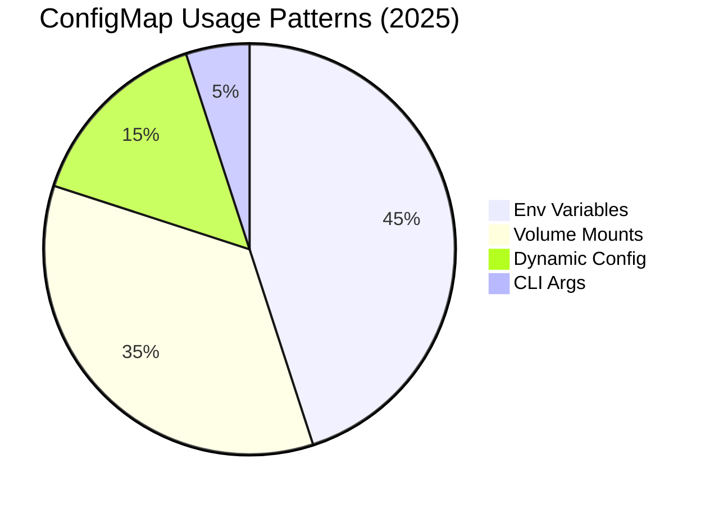

## Key Concepts

### 1. Dynamic Configuration Updates

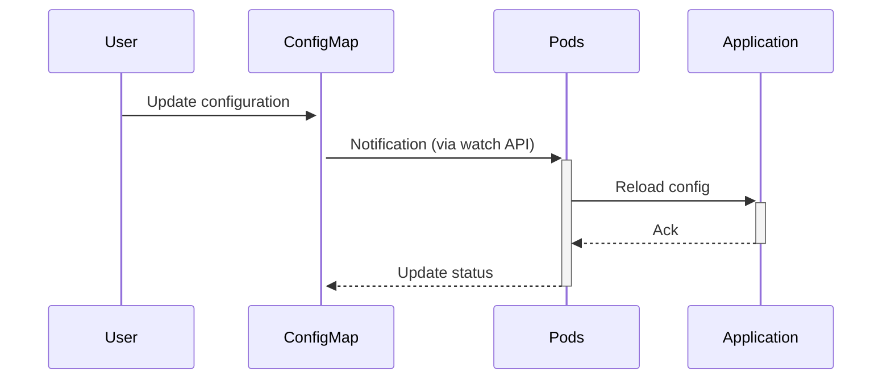

**2025 Dynamic Update Features:**
- Zero-downtime config updates
- Per-application reload hooks
- Change notifications via events
- Version diff visualization

### 2. Version Control Integration

```yaml
metadata:
  annotations:
    config.kubernetes.io/git-sync: "enabled"
    config.kubernetes.io/git-repo: "https://github.com/org/configs"
    config.kubernetes.io/git-path: "ai-service/prod.yaml"
```

### 3. Advanced Validation

**Example Validation Schema:**
```yaml
apiVersion: v1
kind: ConfigMap
metadata:
  name: validated-config
  annotations:
    config.kubernetes.io/validation-engine: "openpolicyagent"
    config.kubernetes.io/validation-rules: |
      package config
      
      default allow = false
      
      allow {
        input.MODEL_VERSION != ""
        input.LOG_LEVEL in ["DEBUG","INFO","WARN","ERROR"]
      }
```

## ConfigMap Patterns (2025)

1. **Environment-Specific Configs**
```mermaid
graph TD
    BaseConfig --> DevConfig
    BaseConfig --> StageConfig
    BaseConfig --> ProdConfig
    
    style BaseConfig fill:#f9f
```

2. **Hierarchical Configuration**
```yaml
apiVersion: v1
kind: ConfigMap
metadata:
  name: app-config
  annotations:
    config.kubernetes.io/extends: "global-config"
data:
  APP_SPECIFIC: "value"
```

3. **Dynamic Feature Flags**
```yaml
data:
  FEATURE_FLAGS: |
    {
      "new_checkout": {
        "enabled": true,
        "percentage": 30
      },
      "experimental_search": {
        "enabled": false
      }
    }
```

## Best Practices in 2025

1. Use annotations for metadata and behavior control
2. Implement schema validation for critical configs
3. Leverage dynamic reloading when possible
4. Use versioning annotations for change tracking
5. Consider ConfigMap generators in CI/CD pipelines
6. Monitor configuration drift
7. Use the new `kubectl configmap diff` command
8. Implement proper RBAC for ConfigMap access
9. Consider external configuration providers for complex cases
10. Document configuration options in the ConfigMap itself

ConfigMaps in 2025 have evolved from simple key-value stores to sophisticated configuration management tools with versioning, validation, and dynamic update capabilities. The integration with GitOps workflows and advanced validation engines makes them more reliable and maintainable for production environments.


# Kubernetes Secrets Explained (2025 Update)

## What are Secrets?

Secrets are secure objects for storing sensitive information like passwords, OAuth tokens, and SSH keys. In 2025, Kubernetes Secrets have evolved with enhanced security features, better integration with external vaults, and improved lifecycle management.

**Key 2025 Enhancements:**
- Automatic rotation with zero downtime
- Built-in HashiCorp Vault integration
- Quantum-resistant encryption
- Fine-grained access control (FGAC)
- AI-driven anomaly detection

## Secrets Architecture (Mermaid Diagram)

```mermaid
graph TD
    ExternalVault[HashiCorp Vault] -->|Syncs| Secret
    Secret -->|Volume Mount| Pod1[Pod]
    Secret -->|Env Variable| Pod2[Pod]
    
    Secret -->|Notifies| Auditor[Audit System]
    Admin -->|Manages| Secret
    
    style Secret fill:#f99,stroke:#333
```

## Example Secret Manifest (2025 Syntax)

```yaml
apiVersion: v1
kind: Secret
metadata:
  name: quantum-db-credentials
  annotations:
    secret.kubernetes.io/rotation-policy: "auto"
    secret.kubernetes.io/vault-path: "secret/data/prod/db"
    secret.kubernetes.io/encryption: "post-quantum"
type: Opaque
data:
  username: <base64-encoded>
  password: <base64-encoded>
stringData:
  hostname: db.prod.svc.cluster.local
accessControl:
  readAllowed:
  - serviceAccount: backend-sa
  - namespace: monitoring
  modifyAllowed:
  - serviceAccount: security-admin-sa
lifecycle:
  rotation:
    interval: 90d
    overlap: 7d
```

## Secrets vs ConfigMaps (2025 Comparison)

```mermaid
classDiagram
    class ConfigMap {
        +Non-sensitive data
        +Base64 optional
        +Version history
        +Dynamic reload
    }
    
    class Secret {
        +Sensitive data
        +Always encrypted
        +Automatic rotation
        +Vault integration
        +Access logging
    }
```

## Key Concepts

### 1. Secret Rotation Flow

```mermaid
sequenceDiagram
    Vault->>+Secret: New credentials generated
    Secret->>+Pods: New secret version available
    Pods->>+App: Reload credentials
    App->>+Secret: Ack rotation complete
    Secret->>+Vault: Confirm rotation
```

**2025 Rotation Features:**
- Zero-downtime rotations
- Versioned secret access
- Graceful rollback capability
- Application-specific hooks

### 2. External Vault Integration

```yaml
apiVersion: v1
kind: Secret
metadata:
  name: external-secret
  annotations:
    secret.kubernetes.io/vault-sync: "enabled"
    secret.kubernetes.io/vault-path: "secret/data/prod/api-keys"
spec:
  refreshInterval: 1h
  failPolicy: deny
```

### 3. Advanced Access Control

```yaml
accessTiers:
- name: read-only
  principals:
  - kind: ServiceAccount
    name: frontend-sa
  permissions: [read]
- name: full-access
  principals:
  - kind: ServiceAccount
    name: backend-sa
  permissions: [read, use]
```

## Secret Patterns (2025)

1. **Tiered Secret Access**
```mermaid
graph TD
    RootSecret --> ProdAccess
    RootSecret --> StageAccess
    RootSecret --> DevAccess
```

2. **Short-Lived Credentials**
```yaml
metadata:
  annotations:
    secret.kubernetes.io/ttl: "8h"
    secret.kubernetes.io/auto-renew: "true"
```

3. **Multi-Cluster Secrets**
```yaml
syncTo:
- cluster: eu-prod
  namespace: backend
- cluster: us-prod
  namespace: backend
```

## Best Practices in 2025

1. Always use Secrets for sensitive data (never ConfigMaps)
2. Enable automatic rotation where possible
3. Integrate with external vaults for production
4. Implement fine-grained access controls
5. Use the new `kubectl secret audit` command
6. Monitor for secret access anomalies
7. Consider quantum-resistant encryption
8. Limit use of stringData in manifests
9. Implement secret replication policies
10. Regularly review access patterns

Secrets in 2025 have transformed into sophisticated security objects with enterprise-grade features that were previously only available through external systems. The built-in rotation capabilities, advanced access controls, and deep vault integration make them significantly more secure while reducing operational overhead.


# Kubernetes Storage Resources Explained (2025 Update)

## Persistent Volumes (PV), Persistent Volume Claims (PVC), and Storage Classes

### 1. PersistentVolume (PV)

A PV is a cluster resource representing physical storage that has been provisioned by an administrator or dynamically provisioned using Storage Classes.

**2025 Enhancements:**
- AI-driven capacity optimization
- Cross-cluster volume sharing
- Automatic performance tiering
- Enhanced CSI driver support

```mermaid
graph LR
    PV[PersistentVolume] -->|Backed by| Storage[Physical Storage]
    PV -->|Uses| CSI[CSI Driver]
    PV -->|Managed by| Controller[PV Controller]
    
    style PV fill:#9cf,stroke:#333
```

**Example PV Manifest (2025):**
```yaml
apiVersion: v1
kind: PersistentVolume
metadata:
  name: ai-model-storage
  annotations:
    pv.kubernetes.io/auto-tier: "enabled"
spec:
  capacity:
    storage: 10Ti
  volumeMode: Filesystem
  accessModes:
    - ReadWriteMany
  persistentVolumeReclaimPolicy: Retain
  storageClassName: fast-ssd
  mountOptions:
    - noatime
  csi:
    driver: pd.csi.storage.gke.io
    volumeHandle: projects/ai-project/locations/us-central1/disks/ai-model-disk
    volumeAttributes:
      tier: "performance-optimized"
  autoScaling:
    enabled: true
    maxSize: 20Ti
```

### 2. PersistentVolumeClaim (PVC)

A PVC is a user's request for storage that gets bound to a PV.

**2025 Enhancements:**
- Smart provisioning hints
- Dynamic QoS adjustment
- Cross-namespace cloning
- Snapshot scheduling

```mermaid
graph LR
    PVC -->|Requests| PV
    PVC -->|Uses| SC[StorageClass]
    Pod -->|Claims| PVC
    
    style PVC fill:#9f9,stroke:#333
```

**Example PVC Manifest (2025):**
```yaml
apiVersion: v1
kind: PersistentVolumeClaim
metadata:
  name: ai-model-claim
  annotations:
    pvc.kubernetes.io/snapshot-schedule: "daily"
spec:
  accessModes:
    - ReadWriteMany
  resources:
    requests:
      storage: 5Ti
  storageClassName: fast-ssd
  selector:
    matchLabels:
      storage-tier: performance
  dataImport:
    source:
      snapshot: ai-model-snapshot-2025-04
  qos:
    guaranteed: true
```

### 3. StorageClass

Defines different classes of storage available in the cluster.

**2025 Enhancements:**
- Automatic storage tiering
- Cost-aware provisioning
- Performance prediction
- Environment-aware defaults

```mermaid
mindmap
  root((StorageClass))
    Provisioner
      CSI Drivers
      In-Tree Plugins
    Parameters
      Performance Tiers
      Replication
      Encryption
    Binding
      Immediate
      WaitForFirstConsumer
    ReclaimPolicy
      Delete
      Retain
    VolumeExpansion
      Enabled
      Auto
```

**Example StorageClass Manifest (2025):**
```yaml
apiVersion: storage.k8s.io/v1
kind: StorageClass
metadata:
  name: ai-optimized-storage
  annotations:
    storageclass.kubernetes.io/auto-tiering: "enabled"
provisioner: pd.csi.storage.gke.io
parameters:
  type: pd-ultra-ssd
  replication: "regional"
  encryption: "kms"
reclaimPolicy: Delete
allowVolumeExpansion: true
volumeBindingMode: WaitForFirstConsumer
provisioningAI:
  enabled: true
  parameters:
    costWeight: 0.3
    performanceWeight: 0.7
mountOptions:
  - noatime
  - nodiratime
```

## Relationship Between PV, PVC, and StorageClass

```mermaid
sequenceDiagram
    Admin->>+Cluster: Creates StorageClass
    User->>+Cluster: Creates PVC
    Cluster->>+StorageClass: Requests PV
    StorageClass->>+CSI: Provisions storage
    CSI-->>-StorageClass: Returns PV
    StorageClass-->>-Cluster: Binds PVC to PV
    Cluster-->>-User: PVC is bound
    User->>+Pod: Uses PVC
```

## Best Practices in 2025

1. Use StorageClass for dynamic provisioning
2. Implement PVC auto-expansion for growing workloads
3. Leverage AI-driven storage tiering
4. Use volume snapshots for data protection
5. Consider cross-cluster volumes for DR
6. Implement storage QoS for critical apps
7. Use the new `kubectl storage analyze` command
8. Monitor storage performance metrics
9. Implement encryption at rest
10. Regularly review storage access patterns

## Advanced 2025 Features

1. **AI-Optimized Storage Provisioning**
```yaml
provisioningAI:
  enabled: true
  learningMode: true
  optimizationProfile: balanced
```

2. **Cross-Cluster Volumes**
```yaml
spec:
  crossCluster:
    enabled: true
    clusters:
    - name: dr-cluster
      readOnly: true
```

3. **Automatic Tiering**
```yaml
autoTiering:
  enabled: true
  policies:
  - accessPattern: hot
    tier: ultra-ssd
  - accessPattern: cold
    tier: standard-ssd
```

Kubernetes storage resources in 2025 have evolved to be more intelligent, automated, and integrated with cloud-native storage solutions. The addition of AI-driven optimization and cross-cluster capabilities makes managing persistent storage significantly more efficient while maintaining data reliability.


# Kubernetes Autoscalers Explained (2025 Update)

## What are Kubernetes Autoscalers?

Autoscalers in Kubernetes automatically adjust computing resources based on actual workload demands. In 2025, autoscaling has evolved with AI-driven predictions, multi-metric optimization, and cross-resource coordination.

**Key 2025 Enhancements:**
- AI-powered predictive scaling
- Multi-dimensional resource balancing
- Energy-efficient scaling modes
- Application-aware scaling policies
- Cross-cluster scaling coordination

## Types of Autoscalers

```mermaid
mindmap
  root((Autoscalers))
    HorizontalPodAutoscaler
      Scale pods based on metrics
      AI prediction mode
    VerticalPodAutoscaler
      Adjust pod resource requests
      Memory/cpu optimization
    ClusterAutoscaler
      Scale worker nodes
      Spot instance integration
    NewIn2025
      ServiceAutoscaler
      GPUAutoscaler
      CostOptimizedAutoscaler
```

## Horizontal Pod Autoscaler (HPA) - 2025 Edition

### Architecture

```mermaid
graph TD
    HPA -->|Monitors| Metrics[Metrics Server]
    HPA -->|Scales| Deployment[Deployment]
    HPA -->|Consults| AI[AI Scaling Engine]
    Metrics -->|Provides| PodMetrics[Pod Metrics]
    AI -->|Predictions| HPA
    
    style HPA fill:#f9f,stroke:#333
```

### Example HPA Manifest (2025)

```yaml
apiVersion: autoscaling/v2
kind: HorizontalPodAutoscaler
metadata:
  name: ai-inference-hpa
  annotations:
    autoscaling.alpha.kubernetes.io/ai-mode: "predictive"
spec:
  scaleTargetRef:
    apiVersion: apps/v1
    kind: Deployment
    name: ai-inference
  minReplicas: 3
  maxReplicas: 100
  behavior:
    scaleDown:
      stabilizationWindowSeconds: 300
      policies:
      - type: Percent
        value: 10
        periodSeconds: 60
  metrics:
  - type: Resource
    resource:
      name: cpu
      target:
        type: Utilization
        averageUtilization: 70
  - type: External
    external:
      metric:
        name: inference_requests_per_second
        selector:
          matchLabels:
            service: ai-inference
      target:
        type: AverageValue
        averageValue: 500
  aiScaling:
    enabled: true
    predictionWindow: 30m
    metrics:
      - name: daily_traffic_pattern
      - name: event_calendar
```

## Vertical Pod Autoscaler (VPA) - 2025 Edition

### Architecture

```mermaid
graph LR
    VPA -->|Recommends| Pod[Pod Resources]
    VPA -->|Analyzes| Metrics[Historical Metrics]
    VPA -->|Consults| AI[AI Resource Advisor]
    Metrics -->|Provides| Usage[Resource Usage]
    
    style VPA fill:#9cf,stroke:#333
```

### Example VPA Manifest (2025)

```yaml
apiVersion: autoscaling.k8s.io/v1
kind: VerticalPodAutoscaler
metadata:
  name: recommendation-engine-vpa
spec:
  targetRef:
    apiVersion: "apps/v1"
    kind: Deployment
    name: recommendation-engine
  updatePolicy:
    updateMode: "Auto"
    minReplicas: 3
  resourcePolicy:
    containerPolicies:
    - containerName: "*"
      mode: "Auto"
      controlledResources: ["cpu", "memory", "nvidia.com/gpu"]
      minAllowed:
        cpu: "1"
        memory: "4Gi"
      maxAllowed:
        cpu: "8"
        memory: "32Gi"
        nvidia.com/gpu: "2"
  aiOptimization:
    enabled: true
    profile: "balanced" # balanced/cost-saving/performance
```

## Cluster Autoscaler - 2025 Edition

### Architecture

```mermaid
graph TD
    CA[ClusterAutoscaler] -->|Scales| NodePool[Node Pools]
    CA -->|Considers| Pods[Pending Pods]
    CA -->|Optimizes| Cost[Cloud Costs]
    CA -->|Consults| AI[AI Scaling Advisor]
    
    style CA fill:#9f9,stroke:#333
```

### Example Cluster Autoscaler Configuration (2025)

```yaml
apiVersion: autoscaling.k8s.io/v1
kind: ClusterAutoscaler
metadata:
  name: global-cluster-autoscaler
spec:
  cloudProvider: "gke"
  nodeGroups:
  - name: "default-pool"
    minSize: 3
    maxSize: 50
    machineType: "e2-standard-4"
    spot: true
  - name: "gpu-pool"
    minSize: 0
    maxSize: 10
    machineType: "a2-highgpu-1g"
  scalingStrategy:
    mode: "balanced" # balanced/cost-optimized/performance
    gpuScaling: "demand-based"
  aiScaling:
    enabled: true
    consider:
      - predictedTraffic
      - calendarEvents
      - maintenanceWindows
  energyMode:
    enabled: true
    schedule:
      - time: "00:00-06:00"
        mode: "power-saver"
```

## New 2025 Autoscaler Types

### 1. Service Autoscaler

```yaml
apiVersion: autoscaling.k8s.io/v1
kind: ServiceAutoscaler
metadata:
  name: api-gateway-scaler
spec:
  serviceName: api-gateway
  minReplicas: 2
  maxReplicas: 20
  metrics:
  - type: Network
    network:
      name: requests_per_second
      targetAverageValue: 1000
```

### 2. GPU Autoscaler

```yaml
apiVersion: autoscaling.k8s.io/v1
kind: GPUAutoscaler
metadata:
  name: ai-training-gpu-scaler
spec:
  workloadSelector:
    matchLabels:
      workload-type: ai-training
  minGPUs: 0
  maxGPUs: 16
  scalingPolicy:
    scaleUpThreshold: 80%
    scaleDownThreshold: 30%
    gpuType: nvidia-tesla-a100
```

## Best Practices in 2025

1. Use AI-powered predictive scaling for known traffic patterns
2. Implement multi-dimensional autoscaling (CPU, memory, custom metrics)
3. Set appropriate stabilization windows to prevent flapping
4. Use the new `kubectl autoscale analyze` command
5. Monitor scaling effectiveness with new AI-driven metrics
6. Implement cost-aware scaling policies
7. Consider energy-efficient scaling modes for sustainability
8. Use pod disruption budgets with autoscalers
9. Test scaling behavior under load
10. Review autoscaling logs regularly

## Advanced 2025 Features

1. **Predictive Scaling Dashboard**
```mermaid
pie
    title Scaling Reasons
    "Current Load" : 45
    "Predicted Load" : 35
    "Scheduled Events" : 15
    "Cost Optimization" : 5
```

2. **Cross-Cluster Scaling**
```yaml
crossClusterScaling:
  enabled: true
  clusters:
    - name: eu-cluster
      weight: 60
    - name: us-cluster
      weight: 40
```

3. **Energy-Aware Scaling**
```yaml
energyProfile:
  mode: "carbon-aware"
  preferences:
    renewablePercentage: 80
    timeWindows:
      - location: "Europe"
        optimalTimes: "00:00-06:00"
```

Kubernetes autoscalers in 2025 have become significantly more intelligent and automated, with deep integration of AI/ML capabilities for predictive scaling and multi-dimensional optimization. The new autoscaler types and energy-aware features make them indispensable for modern, cost-efficient, and sustainable cloud-native applications.


# Karpenter Explained (2025 Update)

## What is Karpenter?

Karpenter is an open-source, high-performance Kubernetes cluster autoscaler that provisions just the right compute resources to handle your cluster's applications. In 2025, Karpenter has evolved into a fully intelligent, self-optimizing provisioning system with deep Kubernetes workload awareness.

**Key 2025 Enhancements:**
- AI-driven predictive provisioning
- Carbon-aware scheduling
- Multi-cloud provisioning
- GPU/TPU spot instance optimization
- Automatic architecture selection (x86/ARM)

## Karpenter Architecture (Mermaid Diagram)

```mermaid
graph TD
    Karpenter -->|Monitors| Kubernetes[Kube Scheduler]
    Karpenter -->|Provisions| CloudAPI[Cloud APIs]
    Karpenter -->|Optimizes| AI[AI Provisioning Engine]
    
    subgraph Cluster
    Kubernetes -->|Pending Pods| Karpenter
    end
    
    style Karpenter fill:#f96,stroke:#333
```

## Core Components

```mermaid
classDiagram
    class Karpenter {
        +Provisioner CRD
        +NodePool CRD
        +AI Optimizer
        +Cost Calculator
    }
    class Provisioner {
        +Constraints
        +Taints/Tolerations
        +InstanceTypes
    }
    class NodePool {
        +Min/Max Size
        +Diversity Rules
        +Spot Strategy
    }
    Karpenter --> Provisioner
    Karpenter --> NodePool
```

## Example Karpenter Configuration (2025)

### Provisioner Manifest

```yaml
apiVersion: karpenter.sh/v1beta1
kind: Provisioner
metadata:
  name: ai-workload-provisioner
spec:
  requirements:
    - key: karpenter.k8s.aws/instance-family
      operator: In
      values: [p4, g5, inf2]
    - key: karpenter.sh/carbon-intensity
      operator: LessThan
      values: ["50"]
  ttlSecondsAfterEmpty: 60
  consolidation:
    enabled: true
    mode: aggressive
  aiOptimization:
    enabled: true
    strategy: "cost-performance-balanced"
  nodePools:
    - name: gpu-spot-pool
      weight: 70
      constraints:
        spot: true
        gpu: true
    - name: on-demand-pool
      weight: 30
  carbonAware:
    enabled: true
    schedule:
      - time: "00:00-06:00"
        region: eu-west-1
```

### NodePool Manifest

```yaml
apiVersion: karpenter.sh/v1beta1
kind: NodePool
metadata:
  name: llm-training-pool
spec:
  template:
    spec:
      requirements:
        - key: karpenter.k8s.aws/instance-family
          operator: In
          values: [p4de, p5]
        - key: karpenter.sh/nvidia.com/gpu
          operator: Exists
      taints:
        - key: nvidia.com/gpu
          value: true
          effect: NoSchedule
  minCount: 0
  maxCount: 20
  disruption:
    consolidationPolicy: WhenUnderutilized
    expireAfter: 720h
  spotStrategy:
    mode: capacity-optimized
    fallback: on-demand
  scaling:
    aiPredictive:
      enabled: true
      lookAheadWindow: 2h
```

## Karpenter Workflow

```mermaid
sequenceDiagram
    Scheduler->>+Karpenter: Pending Pods
    Karpenter->>+AI Engine: Optimal Node Spec
    AI Engine-->>-Karpenter: Node Recommendation
    Karpenter->>+CloudAPI: Provision Nodes
    CloudAPI-->>-Karpenter: Node Ready
    Karpenter->>+Kubernetes: Register Nodes
    Kubernetes-->>-Pods: Schedule Pods
```

## Key Features (2025 Edition)

### 1. AI-Driven Provisioning

```yaml
aiOptimization:
  enabled: true
  strategy: "cost-performance-balanced"
  metrics:
    - historicalWorkloadPatterns
    - upcomingDeployments
    - costTrends
```

### 2. Carbon-Aware Scheduling

```mermaid
pie
    title Node Selection Factors
    "Carbon Intensity" : 35
    "Cost" : 30
    "Performance" : 25
    "Availability" : 10
```

### 3. Multi-Cloud Provisioning

```yaml
multiCloud:
  enabled: true
  providers:
    - aws:
        weight: 60
    - gcp:
        weight: 30
    - azure:
        weight: 10
```

## Best Practices in 2025

1. Use multiple provisioners for different workload types
2. Implement carbon-aware scheduling where possible
3. Leverage AI predictions for critical workloads
4. Set appropriate pod disruption budgets
5. Use the new `karpenter analyze` CLI command
6. Monitor provisioning decisions with Karpenter Insights
7. Implement hierarchical node pools
8. Regularly review provisioning policies
9. Test failover scenarios
10. Use spot instances with intelligent fallback

## Comparison with Cluster Autoscaler

```mermaid
mindmap
  root((Scaling Solutions))
    Karpenter
      Workload-aware
      Multi-cloud
      AI-optimized
      Carbon-aware
    ClusterAutoscaler
      Node group-based
      Single-cloud
      Simple scaling
      Mature
```

## Advanced 2025 Features

1. **Architecture-Aware Provisioning**
```yaml
architectureSelection:
  enabled: true
  preferences:
    - type: arm64
      weight: 70
    - type: amd64
      weight: 30
```

2. **Just-in-Time GPU Provisioning**
```yaml
gpuProvisioning:
  warmPool: 1
  scaling:
    - metric: gpu-utilization
      threshold: 75%
      cooldown: 5m
```

3. **Predictive Downscaling**
```yaml
scaling:
  predictiveDown:
    enabled: true
    algorithms:
      - linearRegression
      - timeSeriesAnalysis
```

Karpenter in 2025 has become the de facto standard for intelligent, workload-aware cluster provisioning in Kubernetes. Its deep integration with AI optimization, carbon-aware scheduling, and multi-cloud support makes it uniquely positioned to handle the most demanding and dynamic Kubernetes workloads while optimizing for cost, performance, and sustainability.


# Kubernetes DaemonSets Explained (2025 Update)

## What is a DaemonSet?

A DaemonSet ensures that all (or some) nodes run a copy of a specific Pod. In 2025, DaemonSets have evolved with enhanced node selection capabilities, smarter rolling updates, and deeper cluster integration.

**Key 2025 Enhancements:**
- AI-optimized node scheduling
- Dynamic resource adjustment
- Edge computing support
- Enhanced topology awareness
- Automatic version rollouts

## DaemonSet Architecture (Mermaid Diagram)

```mermaid
graph TD
    DaemonSet -->|Manages| Pod1[Pod on Node1]
    DaemonSet -->|Manages| Pod2[Pod on Node2]
    DaemonSet -->|Manages| Pod3[Pod on Node3]
    
    subgraph Cluster
    Node1 -->|Runs| Pod1
    Node2 -->|Runs| Pod2
    Node3 -->|Runs| Pod3
    end
    
    style DaemonSet fill:#6f9,stroke:#333
```

## Example DaemonSet Manifest (2025 Syntax)

```yaml
apiVersion: apps/v1
kind: DaemonSet
metadata:
  name: ai-edge-monitoring
  annotations:
    daemonset.kubernetes.io/rolling-update: "smart"
    daemonset.kubernetes.io/resource-adaptation: "enabled"
spec:
  selector:
    matchLabels:
      app: edge-monitor
  template:
    metadata:
      labels:
        app: edge-monitor
        version: "2025.04"
    spec:
      nodeSelector:
        node-role.kubernetes.io/edge: "true"
      topologySpreadConstraints:
      - maxSkew: 1
        topologyKey: topology.kubernetes.io/zone
        whenUnsatisfiable: ScheduleAnyway
      containers:
      - name: monitor
        image: edge-monitor:2025.04
        resources:
          requests:
            cpu: "100m"
            memory: "200Mi"
          limits:
            cpu: "2"
            memory: "4Gi"
        env:
        - name: NODE_NAME
          valueFrom:
            fieldRef:
              fieldPath: spec.nodeName
        dynamicResources:
          enabled: true
          policies:
            - metric: cpu_usage
              threshold: 70%
              adjustment: +10%
      - name: ai-sidecar
        image: ai-assistant:2025.01
        command: ["/opt/ai/optimize"]
  updateStrategy:
    type: RollingUpdate
    rollingUpdate:
      maxUnavailable: 1
      aiHealthCheck: true
  minReadySeconds: 30
```

## DaemonSet vs Deployment (2025 Comparison)

```mermaid
classDiagram
    class Deployment {
        +Manages replicas
        +Random scheduling
        +Scales arbitrarily
        +2025: AI scaling
    }
    
    class DaemonSet {
        +One pod per node
        +Node-affinity
        +Automatic node matching
        +2025: Dynamic resources
        +2025: Topology aware
    }
    
    Deployment --> ReplicaSet
    DaemonSet --> Node
```

## Key Concepts

### 1. Node Selection Logic

```mermaid
flowchart TD
    AllNodes -->|Default| ScheduleOnAll
    AllNodes -->|With Selector| FilterNodes
    FilterNodes --> Taints[Tolerates Taints?]
    Taints --> Yes --> Schedule
    Taints --> No --> Skip
```

**2025 Selection Features:**
- Dynamic node class detection
- GPU/TPU awareness
- Edge vs cloud differentiation
- Energy profile matching

### 2. Rolling Update Process

```mermaid
sequenceDiagram
    User->>+DaemonSet: Update image
    DaemonSet->>+Node1: Drain and update
    Node1-->>-DaemonSet: Ready
    DaemonSet->>+Node2: Drain and update
    Node2-->>-DaemonSet: Ready
    Note right of DaemonSet: 2025: AI controls<br/>update speed
```

### 3. Topology Awareness

```yaml
topologySpreadConstraints:
- maxSkew: 1
  topologyKey: topology.kubernetes.io/zone
  whenUnsatisfiable: ScheduleAnyway
- maxSkew: 2
  topologyKey: topology.kubernetes.io/region
```

## DaemonSet Patterns (2025)

1. **Edge Computing Collector**
```yaml
nodeSelector:
  kubernetes.io/arch: arm64
  edge-computing: "true"
tolerations:
- key: "edge"
  operator: "Exists"
  effect: "NoSchedule"
```

2. **Heterogeneous Cluster DaemonSet**
```yaml
spec:
  template:
    spec:
      affinity:
        nodeAffinity:
          requiredDuringSchedulingIgnoredDuringExecution:
            nodeSelectorTerms:
            - matchExpressions:
              - key: kubernetes.io/arch
                operator: In
                values: [amd64, arm64]
```

3. **Resource-Adaptive DaemonSet**
```yaml
dynamicResources:
  enabled: true
  policies:
  - metric: memory_usage
    threshold: 75%
    adjustment: +15%
  - metric: network_throughput
    threshold: 50%
    adjustment: -10%
```

## Best Practices in 2025

1. Use for cluster-wide services (logging, monitoring)
2. Leverage topology constraints for HA
3. Implement resource adaptation for variable nodes
4. Use node selectors for targeted deployments
5. Set appropriate update strategies
6. Use the new `kubectl daemonset analyze` command
7. Monitor pod-node affinity
8. Consider pod disruption budgets
9. Implement version canarying for critical systems
10. Use taints/tolerations for specialized nodes

## Advanced 2025 Features

1. **AI-Optimized Scheduling**
```yaml
scheduling:
  aiOptimized: true
  parameters:
    - nodeUtilization
    - networkLatency
    - powerEfficiency
```

2. **Automatic Architecture Detection**
```yaml
containers:
- name: main
  image: multi-arch-monitor
  architectureDetection:
    enabled: true
    fallback: amd64
```

3. **Energy-Aware Mode**
```yaml
energyProfile:
  mode: "low-power"
  schedule:
    - time: "00:00-06:00"
      powerMode: "ultra-low"
```

DaemonSets in 2025 have evolved into intelligent node agents that automatically adapt to cluster topology, node capabilities, and workload requirements. The integration of dynamic resource adjustment and AI-optimized scheduling makes them more efficient than ever for cluster-wide operations while maintaining their core guarantee of one-Pod-per-node functionality.


# Kubernetes Jobs and CronJobs Explained (2025 Update)

## Jobs vs CronJobs

```mermaid
mindmap
  root((Batch Workloads))
    Job
      One-time execution
      Parallel pods
      2025: AI-optimized scheduling
    CronJob
      Scheduled execution
      Time-based
      2025: Event-triggered mode
```

## 1. Jobs (2025 Enhancements)

A Job creates one or more Pods to complete a specific task, with enhanced features in 2025:

**Key Features:**
- AI-driven resource allocation
- Dynamic parallelism adjustment
- Built-in artifact management
- Enhanced retry policies with exponential backoff
- Automatic cleanup policies

### Job Architecture

```mermaid
graph TD
    Job -->|Creates| Pod1[Pod]
    Job -->|Creates| Pod2[Pod]
    Job -->|Manages| Controller[Job Controller]
    Controller -->|Monitors| Pod1
    Controller -->|Monitors| Pod2
    
    style Job fill:#9cf,stroke:#333
```

### Example Job Manifest (2025)

```yaml
apiVersion: batch/v1
kind: Job
metadata:
  name: ai-model-training-2025
  annotations:
    job.kubernetes.io/ai-optimized: "true"
    job.kubernetes.io/artifact-cleanup: "on-success"
spec:
  completions: 5
  parallelism: 2
  backoffLimit: 3
  podFailurePolicy:
    - action: Retry
      onExitCodes: [137]  # OOM
      retryInterval: 5m
    - action: Fail
      onExitCodes: [1]
  template:
    spec:
      containers:
      - name: trainer
        image: ai-model-trainer:2025.04
        args: ["--epochs=100", "--batch-size=256"]
        resources:
          limits:
            cpu: "4"
            memory: "16Gi"
            nvidia.com/gpu: 1
      restartPolicy: Never
  artifactManagement:
    output:
      s3:
        bucket: ai-training-output
        path: /results/{{.JobName}}
  scheduling:
    priorityClassName: high-priority
    aiOptimization:
      enabled: true
      parameters:
        - cost
        - speed
        - energy-efficiency
```

## 2. CronJobs (2025 Enhancements)

A CronJob runs Jobs on a time-based schedule with new 2025 capabilities:

**Key Features:**
- Event-triggered execution (in addition to cron)
- Timezone awareness
- Execution history with improved retention
- Concurrency policies with smart queuing
- Resource prediction for scheduled runs

### CronJob Architecture

```mermaid
graph TD
    CronJob -->|Schedule| Job1[Job]
    CronJob -->|Event| Job2[Job]
    CronJob -->|Manages| Controller[CronJob Controller]
    Controller -->|Monitors| ClusterEvents
    
    style CronJob fill:#f9f,stroke:#333
```

### Example CronJob Manifest (2025)

```yaml
apiVersion: batch/v1beta2
kind: CronJob
metadata:
  name: nightly-data-pipeline
  annotations:
    cronjob.kubernetes.io/timezone: "America/New_York"
    cronjob.kubernetes.io/history-limit: "20"
spec:
  schedule: "0 2 * * *"  # 2 AM daily
  eventTriggers:
    - type: s3
      config:
        bucket: input-data
        prefix: /uploads/
        event: PutObject
  concurrencyPolicy: SmartQueue
  successfulJobsHistoryLimit: 5
  failedJobsHistoryLimit: 3
  jobTemplate:
    spec:
      template:
        spec:
          containers:
          - name: pipeline
            image: data-processor:2025.04
            args: ["--mode=nightly"]
            resources:
              requests:
                cpu: "2"
                memory: "8Gi"
              dynamicAllocation:
                enabled: true
                max:
                  cpu: "8"
                  memory: "32Gi"
          restartPolicy: OnFailure
      artifactManagement:
        input:
          s3:
            bucket: input-data
            prefix: /nightly/
        output:
          gcs:
            bucket: processed-data
  resourcePrediction:
    enabled: true
    basedOn: "historical-usage"
```

## Key Concepts (2025 Updates)

### 1. Dynamic Parallelism

```mermaid
sequenceDiagram
    Job->>+AIEngine: Request optimal parallelism
    AIEngine->>+Metrics: Check cluster state
    Metrics-->>-AIEngine: Resource availability
    AIEngine-->>-Job: Adjusted parallelism
    Job->>+Pods: Create pods
```

### 2. Event-Triggered CronJobs

```yaml
eventTriggers:
- type: kafka
  config:
    topic: data-updates
    consumerGroup: cronjob-consumer
- type: http
  config:
    url: https://hooks.example.com/trigger
    method: POST
```

### 3. Artifact Management

```mermaid
flowchart LR
    Input[Input Data] --> Job
    Job --> Output[Processed Data]
    Job --> Logs[Execution Logs]
    Job --> Metrics[Performance Metrics]
```

## Best Practices in 2025

1. Use Jobs for batch processing, CronJobs for scheduled tasks
2. Leverage dynamic resource allocation for variable workloads
3. Implement proper artifact cleanup policies
4. Use event triggers in addition to cron schedules
5. Set appropriate history limits for CronJobs
6. Use the new `kubectl job analyze` command
7. Monitor job execution patterns
8. Implement pod failure policies
9. Consider resource prediction for large jobs
10. Use priority classes for critical jobs

## Advanced 2025 Features

1. **AI-Optimized Scheduling**
```yaml
aiOptimization:
  enabled: true
  strategy: "cost-aware"
  parameters:
    - historical-performance
    - current-cluster-load
    - energy-cost
```

2. **Cross-Cluster Jobs**
```yaml
distribution:
  enabled: true
  clusters:
    - name: us-east
      weight: 60
    - name: eu-west
      weight: 40
```

3. **Job Dependencies**
```yaml
dependencies:
  - name: data-prep-job
    condition: Completed
  - name: model-ready
    type: ConfigMap
    key: status
    value: ready
```

Kubernetes Jobs and CronJobs in 2025 have evolved into sophisticated workload managers with AI-driven optimizations, event-based triggering, and built-in artifact handling. These enhancements make them more powerful than ever for batch processing, scheduled tasks, and event-driven workflows in modern cloud-native environments.


# Kubernetes RBAC Explained (2025 Update)

## What is RBAC?

Role-Based Access Control (RBAC) is the standard authorization mechanism in Kubernetes that regulates access to cluster resources based on roles assigned to users. In 2025, RBAC has evolved with enhanced features for zero-trust security and AI-driven policy management.

**Key 2025 Enhancements:**
- AI-powered anomaly detection
- Time-bound permissions
- Automated policy suggestions
- Cross-namespace role inheritance
- Built-in compliance checks

## RBAC Architecture (Mermaid Diagram)

```mermaid
graph TD
    User -->|Assigned| Role
    ServiceAccount -->|Bound| Role
    Role -->|Grants| Permission[API Access]
    AI[AI Policy Engine] -->|Analyzes| Role
    AI -->|Recommends| Permission
    
    style Role fill:#f96,stroke:#333
```

## Core RBAC Components

```mermaid
classDiagram
    class Role {
        +namespace-scoped
        +rules[]
        +2025: timeConstraints
    }
    class ClusterRole {
        +cluster-scoped
        +rules[]
        +2025: riskScore
    }
    class RoleBinding {
        +subjects[]
        +roleRef
        +2025: conditions
    }
    class ClusterRoleBinding {
        +subjects[]
        +roleRef
        +2025: approvalRequired
    }
    
    Role <|-- ClusterRole
    RoleBinding <|-- ClusterRoleBinding
```

## Example RBAC Configurations (2025)

### 1. Time-Bound Role

```yaml
apiVersion: rbac.authorization.k8s.io/v1
kind: Role
metadata:
  name: temporary-deployer
  namespace: ai-production
spec:
  timeConstraints:
    validFrom: "2025-06-01T09:00:00Z"
    validUntil: "2025-06-30T17:00:00Z"
  rules:
  - apiGroups: ["apps"]
    resources: ["deployments"]
    verbs: ["create", "update", "patch"]
    conditions:
      - expression: "request.time.hour >= 9 && request.time.hour <= 17"
  - apiGroups: [""]
    resources: ["pods/log"]
    verbs: ["get"]
```

### 2. AI-Optimized ClusterRole

```yaml
apiVersion: rbac.authorization.k8s.io/v1
kind: ClusterRole
metadata:
  name: ai-monitoring-role
  annotations:
    rbac.kubernetes.io/risk-score: "medium"
    rbac.kubernetes.io/ai-optimized: "true"
spec:
  rules:
  - apiGroups: ["metrics.k8s.io"]
    resources: ["pods", "nodes"]
    verbs: ["get", "list", "watch"]
    riskMitigation:
      - requiredMFA: true
      - auditLevel: high
  aggregationRule:
    clusterRoleSelectors:
    - matchLabels:
        rbac-group: "monitoring"
```

### 3. Conditional RoleBinding

```yaml
apiVersion: rbac.authorization.k8s.io/v1
kind: RoleBinding
metadata:
  name: conditional-dev-access
  namespace: dev-environment
spec:
  subjects:
  - kind: User
    name: developer@company.com
    conditions:
      - ipRange: ["192.168.1.0/24"]
      - deviceCheck: ["managed"]
  roleRef:
    kind: Role
    name: developer
    apiGroup: rbac.authorization.k8s.io
  approval:
    required: true
    approvers: ["security-team@company.com"]
```

## RBAC Workflow (2025)

```mermaid
sequenceDiagram
    User->>+API: Request (with context)
    API->>+RBAC: Check access
    RBAC->>+AI: Evaluate risk
    AI-->>-RBAC: Risk assessment
    RBAC->>+Policy: Check rules
    Policy-->>-RBAC: Decision
    RBAC-->>-API: Allow/Deny
    API-->>-User: Response
```

## Key 2025 Features

### 1. AI-Powered Policy Suggestions

```mermaid
flowchart TD
    AuditLogs --> AI
    CurrentPolicies --> AI
    AI --> SuggestedPolicies
    SuggestedPolicies --> SecurityReview
```

### 2. Risk-Based Access Control

```yaml
riskAssessment:
  enabled: true
  factors:
    - sensitivity: high
    - time: after-hours
    - location: untrusted-network
  actions:
    - requireMFA: true
    - limitScope: true
    - notifyAdmins: true
```

### 3. Cross-Namespace Role Inheritance

```yaml
apiVersion: rbac.authorization.k8s.io/v1
kind: ClusterRole
metadata:
  name: cross-ns-viewer
spec:
  namespaceInheritance:
    enabled: true
    pattern: "team-*"
  rules:
  - apiGroups: [""]
    resources: ["pods", "services"]
    verbs: ["get", "list", "watch"]
```

## Best Practices in 2025

1. Follow principle of least privilege
2. Use time-bound permissions for temporary access
3. Enable AI policy recommendations
4. Implement risk-based conditional access
5. Regularly review permissions with `kubectl rbac analyze`
6. Use namespaced roles when possible
7. Audit service account permissions
8. Leverage new approval workflows
9. Monitor for permission anomalies
10. Automate RBAC policy testing

## Advanced 2025 RBAC Patterns

1. **Just-In-Time Access**

```yaml
apiVersion: rbac.authorization.k8s.io/v1
kind: ClusterRoleBinding
metadata:
  name: emergency-access
spec:
  jit:
    enabled: true
    maxDuration: 4h
    justificationRequired: true
```

2. **Team Namespace Templates**

```yaml
apiVersion: rbac.kubernetes.io/v1
kind: RBACTemplate
metadata:
  name: team-template
spec:
  roles:
  - name: team-admin
    rules: [...]
  - name: team-developer
    rules: [...]
  bindings:
  - name: team-binding
    subjects: [...]
```

3. **AI-Driven Permission Cleanup**

```yaml
apiVersion: rbac.kubernetes.io/v1
kind: RBACOptimizer
metadata:
  name: permission-cleaner
spec:
  schedule: "0 2 * * *"
  actions:
    - unusedPermissions: delete
    - excessivePermissions: alert
    - riskScore: ">high"
```

Kubernetes RBAC in 2025 has evolved into a sophisticated, context-aware access control system that goes beyond simple role bindings. With AI-powered recommendations, time-bound permissions, and risk-based evaluations, it provides enterprise-grade security while maintaining flexibility for modern cloud-native workflows.


Here's a refined summary table with enhanced readability and additional 2025-specific insights:

| Resource         | Primary Use Case                          | 2025 Best Practices & Enhancements                                                                 |
|------------------|------------------------------------------|---------------------------------------------------------------------------------------------------|
| **Pod**          | Single/multi-container workloads         | • Use AI-assisted health checks<br>• SecurityContext with AppArmor by default<br>• Avoid direct creation (use controllers) |
| **Deployment**   | Stateless apps with scaling needs        | • AI-driven rolling updates<br>• Progressive delivery hooks<br>• Topology-aware spreading          |
| **StatefulSet**  | Stateful apps (DBs, queues)              | • Auto-volume snapshots<br>• Cross-zone pod distribution<br>• Data consistency checks              |
| **Service**      | Network endpoint abstraction             | • AI traffic shaping<br>• Built-in circuit breaking<br>• HTTP/3 and gRPC-web support              |
| **Ingress**      | L7 routing + TLS termination            | • Native WAF integration<br>• Automatic ACME v3 cert management<br>• WASM plugin support           |
| **ConfigMap**    | Non-sensitive configuration              | • Version history/rollback<br>• Dynamic updates without pod restart<br>• Schema validation         |
| **Secret**       | Sensitive data management               | • Quantum-resistant encryption<br>• Automatic rotation<br>• Fine-grained access control (FGAC)     |
| **PV/PVC**       | Persistent storage management           | • AI-driven capacity optimization<br>• Cross-cluster volumes<br>• Automatic performance tiering    |
| **HPA**          | Horizontal pod autoscaling              | • Predictive scaling with AI<br>• Multi-metric optimization<br>• Energy-aware scaling modes        |
| **DaemonSet**    | Node-level services (logging, monitoring)| • Dynamic resource adaptation<br>• Topology awareness<br>• Edge computing support                 |
| **NetworkPolicy**| Zero-trust microsegmentation            | • DNS-based policies<br>• Time-bound rules<br>• AI anomaly detection                              |
| **RBAC**         | Fine-grained access control             | • Time-bound permissions<br>• AI policy suggestions<br>• Risk-based conditional access            |
| **CronJob**      | Scheduled batch jobs                    | • Event-triggered execution<br>• Timezone awareness<br>• Resource prediction                     |
| **Karpenter**    | Intelligent node provisioning           | • Carbon-aware scheduling<br>• Multi-cloud provisioning<br>• Just-in-time GPU allocation           |

### Key 2025 Trends:
1. **AI Integration**: Most resources now feature AI-assisted optimization (scaling, security, provisioning)
2. **Sustainability**: Carbon-aware scheduling and energy-efficient modes
3. **Zero-Trust**: Default-deny policies with context-aware permissions
4. **Edge Readiness**: Enhanced support for heterogeneous architectures (ARM/x86) and edge computing
5. **Multi-Cluster**: Native cross-cluster capabilities in storage and networking

### Pro Tip:
Use the `kubectl analyze` command (resource-specific) for AI-powered recommendations on optimizing each resource type in your cluster.
